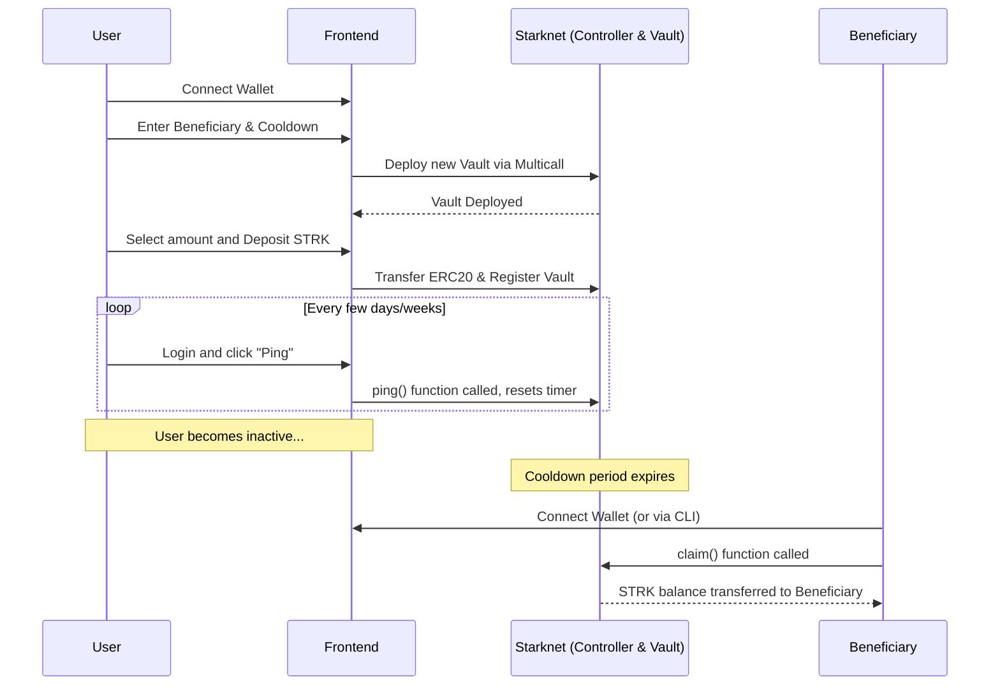

# System Architecture

Ghost Vault's architecture is designed to be minimal to reduce attack surfaces, while leveraging Starknet's account abstraction for an optimal user experience.

## Components

The system primarily consists of two main parts:

1. **The Smart Contracts (Cairo 1.0)**
   - Deployed on **Starknet Sepolia** (and Mainnet eventually).
   - Handles the core logical constraints: verifying deposits, tracking timestamps, and enforcing claims.
2. **The Frontend (Next.js & React)**
   - A client-side application hosted on Vercel/similar hosting.
   - Built using `starknet-react` and `starknet.js` to seamlessly interact with user wallets (Argent X, Braavos).

## The Flow of Operations

### Data Storage & Indexing
Ghost Vault relies purely on on-chain data currently. Whenever the dashboard loads, the frontend reads directly from the Starknet RPC endpoints to gather information about user vaults, balances, and timestamps.
